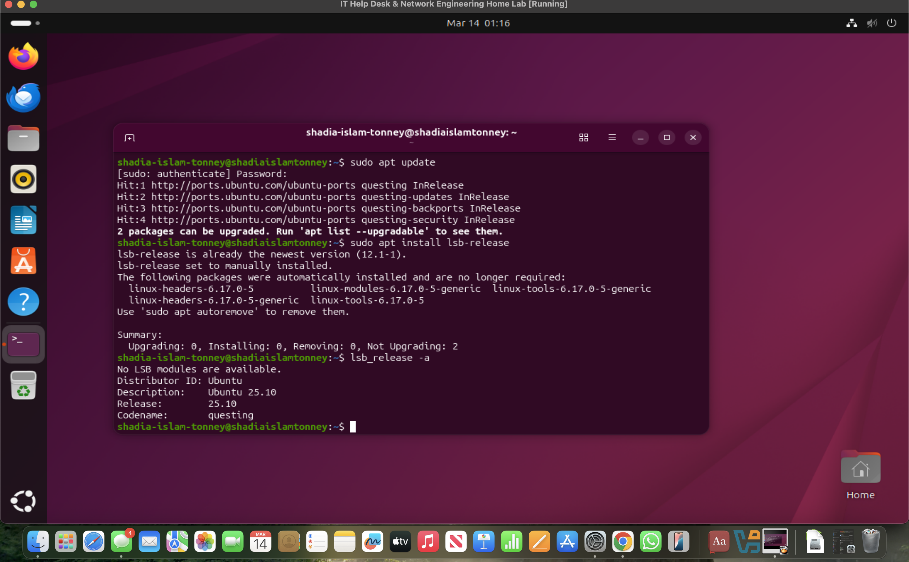
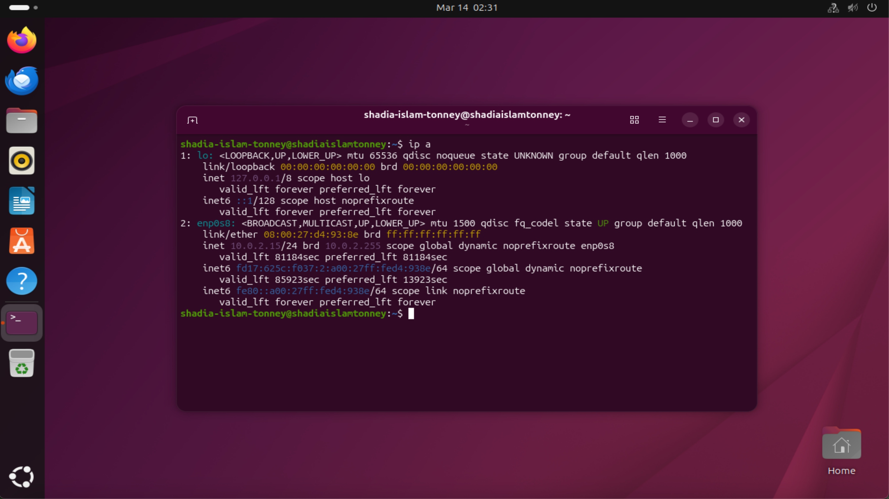

# Lab 1 — Enterprise Network Server Deployment

## Scenario

Southern Star Logistics Pty Ltd operates a centralized IT infrastructure in Melbourne. Employees require a secure server to store internal documents and operational reports.

The IT department decided to deploy an Ubuntu Server in a virtual environment.

As a Junior IT Help Desk Engineer, I deployed the server and verified network connectivity.

---

## Lab Objectives

- Deploy Ubuntu Server in VirtualBox
- Configure network connectivity
- Verify internet access
- Prepare the system for enterprise services

---

## Lab Environment

Virtualization Platform: VirtualBox  
Server OS: Ubuntu Server  
Client OS: Windows 10  
Network Type: NAT Adapter  

---

## Commands Used

```
sudo apt update
sudo apt install lsb-release
lsb_release -a
```

---

## Screenshots

### Ubuntu Installation Verification



*Figure 1: Ubuntu Server running in VirtualBox after installation. The `lsb_release -a` command confirms the operating system version.*

The Ubuntu Server installation was verified using the `lsb_release -a` command. This confirms that the system is running Ubuntu successfully inside the virtual machine.


### Network Configuration Verification



*Figure 2: Output of the `ip a` command showing the active network interface (enp0s8) and assigned IP address (10.0.2.15) from the NAT network.*
