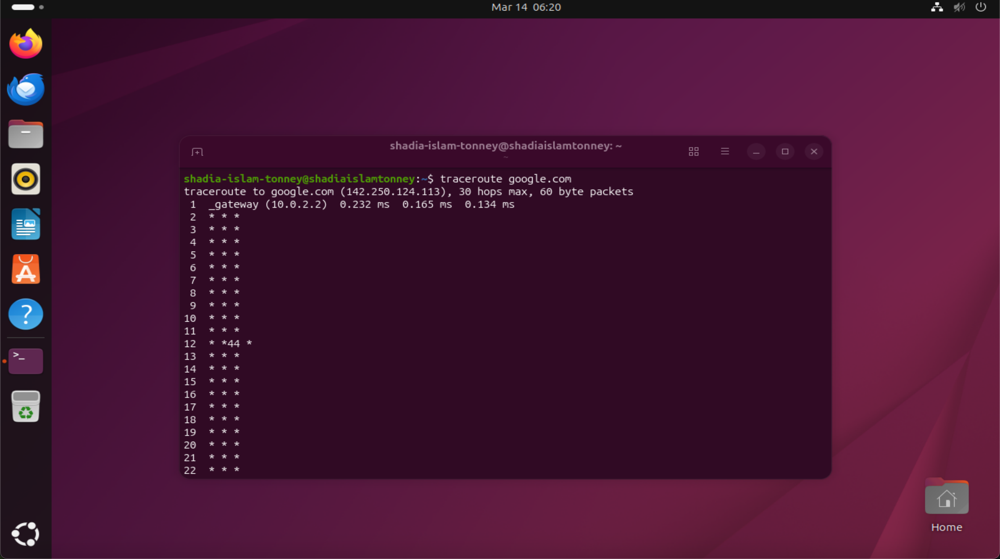

# Lab 2 — Network Troubleshooting & Diagnostics

## Scenario

Southern Star Logistics Pty Ltd operates a centralized IT infrastructure in Melbourne.

Recently, several employees reported that the internal server occasionally fails to connect to external services such as cloud platforms and vendor APIs.

The IT Help Desk team must investigate whether the issue is related to network connectivity or DNS resolution.

As a Junior IT Help Desk Engineer, I performed a series of diagnostic tests using common Linux networking tools.

---

## Lab Objectives

• Verify internet connectivity from the server  
• Test DNS resolution  
• Practice real-world troubleshooting commands used by network engineers  

---

## Lab Environment

Virtualization Platform: VirtualBox  
Server OS: Ubuntu Linux  
Network Type: NAT Adapter  

---

## Commands Used

```
ping google.com
```

---

## Verification

The network connectivity of the Ubuntu server was tested using the `ping` command.

The test confirmed that the server can successfully communicate with external internet hosts.  
Packets were transmitted and received successfully, indicating that the network configuration and DNS resolution are functioning correctly.

---

## Screenshots

### Connectivity Test using Ping


Figure 1: Successful network connectivity verification using the `ping` command to communicate with Google's servers.

### Network Path Analysis using Traceroute



Figure 2: Network route analysis using the `traceroute` command to identify hops between the server and Google's infrastructure.

The traceroute output shows the path packets take from the Ubuntu server to the destination host.  
The first hop represents the VirtualBox NAT gateway (10.0.2.2), while subsequent hops are hidden due to NAT network configuration used in the virtual lab environment.
