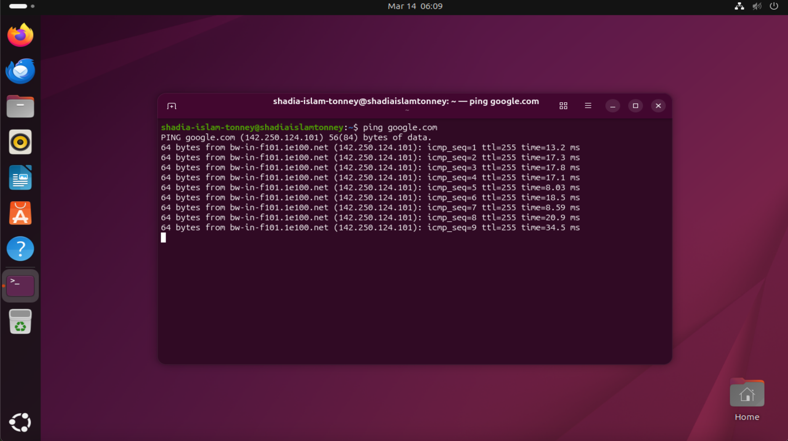
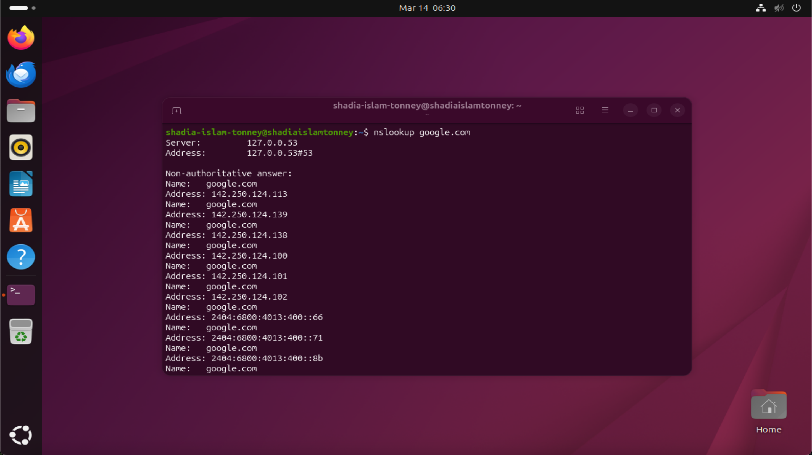

# Lab 2 — WAN Troubleshooting

## Scenario

Southern Star Logistics Pty Ltd operates a centralized IT infrastructure in Melbourne.

Recently, employees reported that some internal systems were experiencing slow or failed connections when accessing external websites and cloud services.

The IT Help Desk team must investigate the issue and verify whether the server has proper WAN connectivity.

As a Junior IT Help Desk Engineer, I performed several diagnostic tests using Linux networking tools to analyze connectivity and identify potential network issues.

---

## Lab Objectives

• Verify WAN connectivity  
• Test DNS resolution  
• Analyse packet routes to external servers  
• Practice real-world troubleshooting commands used by network engineers

---

## Lab Environment

Virtualization Platform: VirtualBox  
Server OS: Ubuntu Linux  
Network Type: NAT Adapter  

---

## Commands Used
```
ping google.com
traceroute google.com
nslookup google.com
dig google.com

```
---

## Screenshots
### WAN Connectivity Test (Ping)



Figure 1: Ping test verifying connectivity between the Ubuntu server and Google's external servers over the WAN.

### WAN Route Analysis (Traceroute)


Figure 2: Traceroute command showing the network path between the Ubuntu server and Google's servers across multiple routers on the WAN.


### DNS Resolution Test (nslookup)



Figure 3: nslookup command verifying DNS resolution by translating the domain name google.com into its corresponding IP address.


## Verification

The WAN troubleshooting tests confirmed that the Ubuntu server has full internet connectivity and proper DNS resolution.

The `ping` command successfully transmitted packets to Google's servers with no packet loss, confirming stable network connectivity.

The `traceroute` command revealed the network path between the internal server and external internet hosts, demonstrating how packets travel through multiple routers across the WAN.

The `nslookup` command verified that DNS services are functioning correctly by resolving the domain name **google.com** into its corresponding IP address.

These results confirm that the server is able to communicate with external internet services without network configuration issues.


## Key Takeaways

This lab demonstrates how basic network troubleshooting tools can be used to diagnose WAN connectivity issues.

Key skills practiced in this lab include:

- Testing internet connectivity using `ping`
- Analysing network paths using `traceroute`
- Verifying DNS resolution using `nslookup`
- Documenting network diagnostics with screenshots

These tools are commonly used by IT Help Desk and Network Engineers to quickly identify connectivity problems in enterprise environments.
